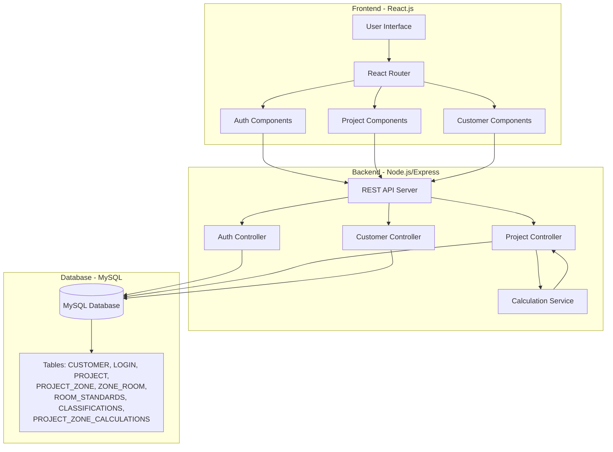
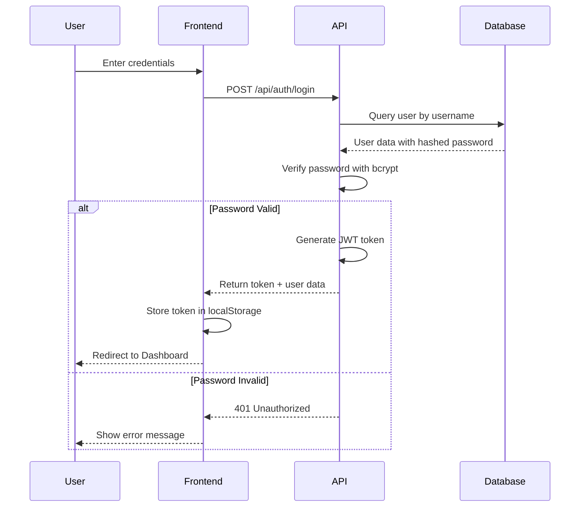
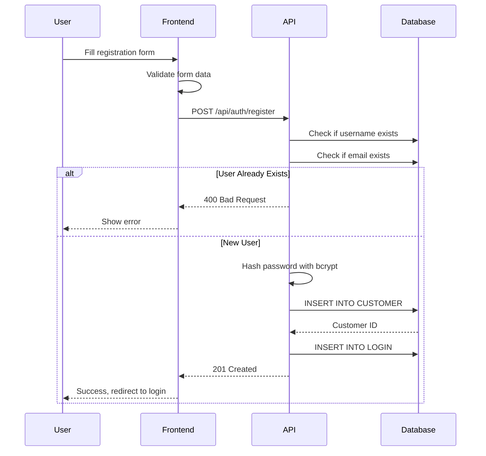
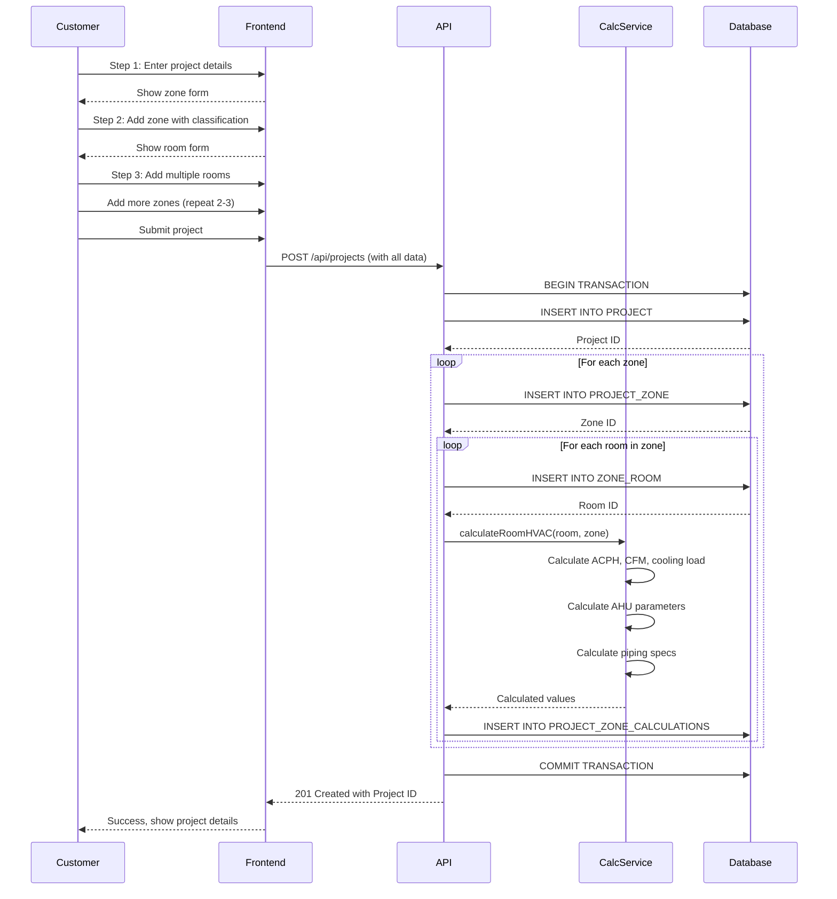
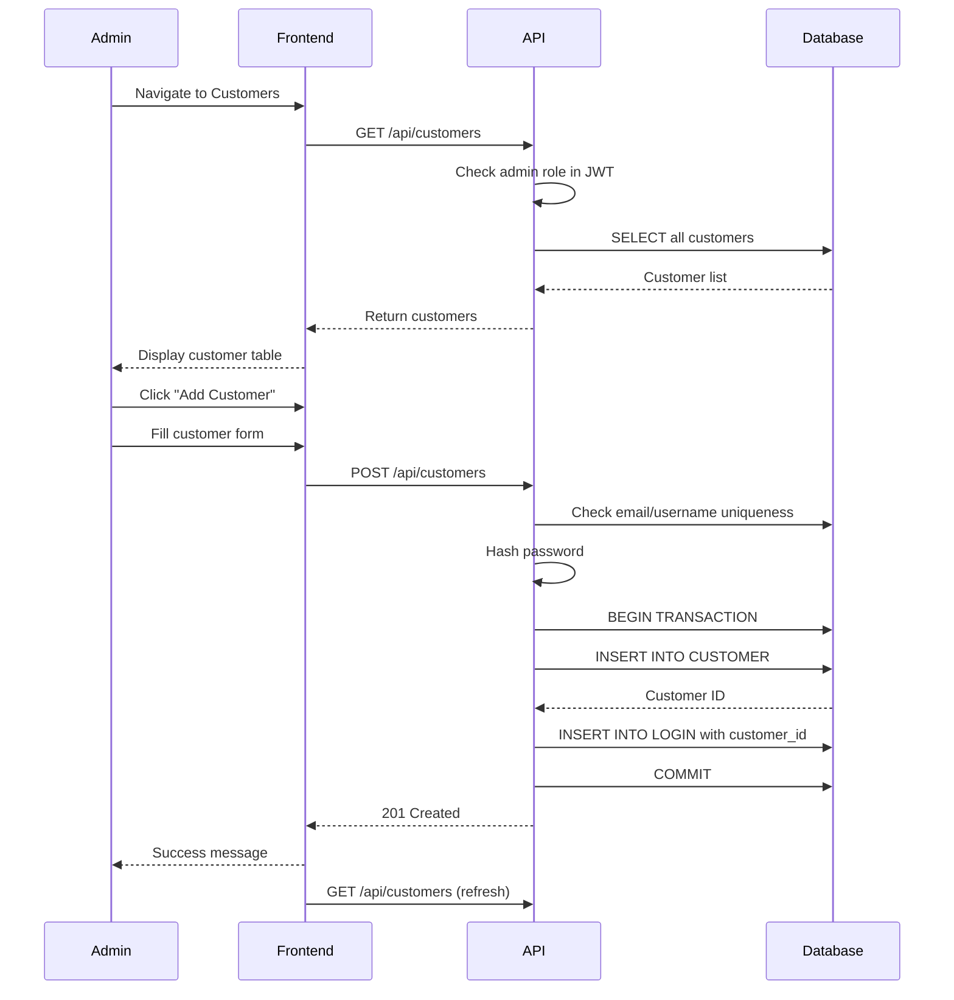
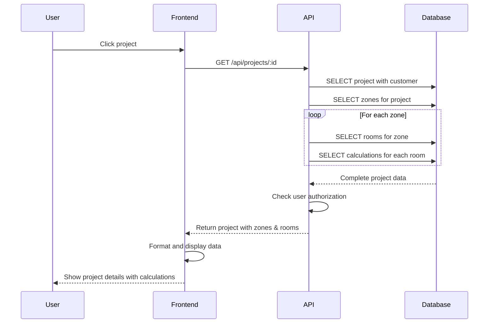
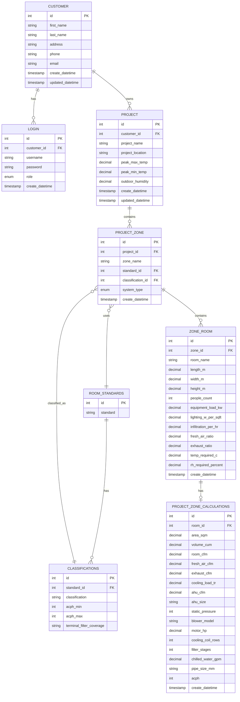
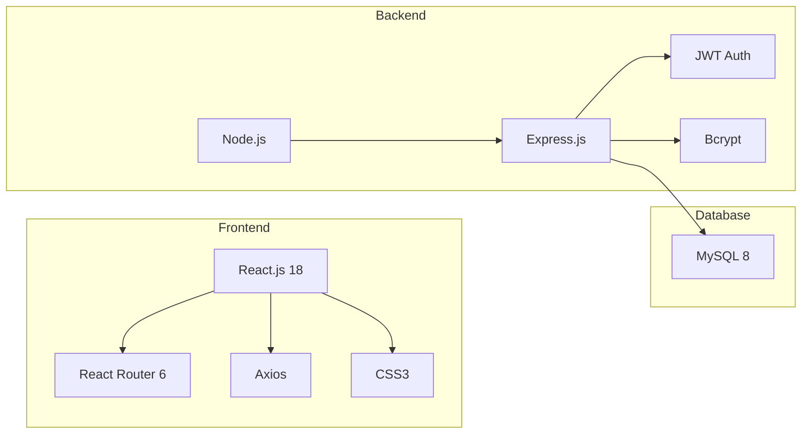

# Cleanroom HVAC Calculator - Design Documentation

## System Architecture



## Authentication Flow



## User Registration Flow



## Project Creation Flow



## HVAC Calculation Process

```mermaid
flowchart TD
    Start[Room Input Data] --> Area[Calculate Area<br/>Area = Length × Width]
    Area --> Volume[Calculate Volume<br/>Volume = Area × Height]
    Volume --> RoomCFM[Calculate Room CFM<br/>CFM = Volume × ACPH / 60]
    RoomCFM --> FreshAir[Calculate Fresh Air<br/>FA = CFM × FA Ratio]
    FreshAir --> Exhaust[Calculate Exhaust<br/>EA = CFM × EA Ratio]
    Exhaust --> Cooling[Calculate Cooling Load<br/>People + Equipment +<br/>Lighting + Infiltration]
    Cooling --> Dehumid[Calculate Dehumidification]
    Dehumid --> Resultant[Calculate Resultant CFM<br/>MAX(CFM + FA, Dehum CFM)]
    Resultant --> Terminal[Calculate Terminal Supply<br/>Based on Classification]
    Terminal --> AHU[Determine AHU Size<br/>Based on CFM]
    AHU --> Motor[Calculate Motor HP<br/>CFM × Pressure / Efficiency]
    Motor --> Coil[Determine Coil Rows<br/>Based on Classification]
    Coil --> Filters[Determine Filter Stages<br/>Based on Classification]
    Filters --> Piping[Calculate Piping<br/>GPM, L/s, Pipe Size]
    Piping --> Output[Save Calculations<br/>to Database]
```

## Customer Management Flow (Admin Only)



## View Project Details Flow



## Database Schema



## Technology Stack



## Key Features

### 1. User Authentication
- JWT-based authentication
- Role-based access control (Admin/Customer)
- Secure password hashing with bcrypt

### 2. Customer Management (Admin)
- Create, read, update, delete customers
- Assign login credentials
- View all customer projects

### 3. Project Management
- Multi-step wizard for project creation
- Support for multiple zones per project
- Multiple rooms per zone
- Environmental parameter configuration

### 4. Standards Support
- ISO 14644-4 (ISO 1-9)
- FDA 209E (Class 1-100K)
- GMP (Grades A-D)
- EU GMP
- JIS B 9920
- TGA, BS 5295, GERMANY VD
- AFNOR X44101
- ISO 14698 (BSL 1-4)
- SCHEDULE M
- NC-Non Classified

### 5. Automated Calculations
- Air Changes Per Hour (ACPH)
- Cubic Feet per Minute (CFM)
- Cooling load in TR
- Fresh air and exhaust requirements
- AHU sizing and specifications
- Motor horsepower
- Cooling coil rows
- Filter stages
- Chilled water flow rates
- Pipe sizing

### 6. Calculation Formulas

#### Basic Calculations
- **Area (m²)** = Length × Width
- **Volume (m³)** = Area × Height
- **Room CFM** = Volume (cuft) × ACPH / 60
- **Fresh Air CFM** = Room CFM × Fresh Air Ratio
- **Exhaust CFM** = Room CFM × Exhaust Ratio

#### Cooling Load
- **People Load** = 70W per person
- **Equipment Load** = Equipment kW × 1000
- **Lighting Load** = Lighting W/sqft × Area sqft
- **Infiltration Load** = Volume × Infiltration × 1.08
- **Total Cooling (TR)** = Total W / 3516.85

#### AHU Sizing
- Based on CFM ranges (200-1450 and beyond)
- Static pressure: 150 (typical)
- **Motor HP** = (CFM × Pressure) / (6356 × η × Safety Factors)

#### Piping
- **GPM** = Cooling Load TR × 24 / 6
- **L/s** = GPM × 0.06309
- **Pipe Size (mm)** = √((4 × GPM × 0.00006309) / (π × Velocity))

## Security Considerations

1. **Password Security**: Bcrypt hashing with salt rounds
2. **JWT Authentication**: Secure token-based auth
3. **Role-Based Access**: Admin vs Customer permissions
4. **Input Validation**: Server-side validation
5. **SQL Injection Prevention**: Parameterized queries
6. **CORS Configuration**: Controlled cross-origin access

## Deployment

### Prerequisites
- Node.js v16+
- MySQL v8+
- npm or yarn

### Environment Variables
```
PORT=5000
DB_HOST=localhost
DB_USER=root
DB_PASSWORD=yourpassword
DB_NAME=cleanroom_db
JWT_SECRET=your_secret_key
JWT_EXPIRE=7d
```

### Installation Steps

1. **Initialize Database**
```bash
cd backend
npm install
npm run db:init
```

2. **Start Backend**
```bash
npm start
```

3. **Start Frontend**
```bash
cd frontend
npm install
npm start
```

4. **Access Application**
- Frontend: http://localhost:3000
- Backend API: http://localhost:5000/api
- Default Admin: username: `admin`, password: `admin123`

## API Endpoints Summary

### Authentication
- `POST /api/auth/login` - User login
- `POST /api/auth/register` - User registration
- `GET /api/auth/me` - Get current user

### Customers (Admin)
- `GET /api/customers` - Get all customers
- `GET /api/customers/:id` - Get customer by ID
- `POST /api/customers` - Create customer
- `PUT /api/customers/:id` - Update customer
- `DELETE /api/customers/:id` - Delete customer

### Standards
- `GET /api/standards` - Get all standards
- `GET /api/standards/classifications` - Get all classifications
- `GET /api/standards/:id/classifications` - Get classifications for standard

### Projects
- `GET /api/projects` - Get all user projects
- `GET /api/projects/:id` - Get project details
- `POST /api/projects` - Create new project
- `PUT /api/projects/:id` - Update project
- `DELETE /api/projects/:id` - Delete project

## Future Enhancements

1. Export calculations to PDF/Excel
2. Project templates
3. Historical comparison
4. Cost estimation
5. Equipment vendor integration
6. Mobile app
7. Real-time collaboration
8. Advanced reporting and analytics
9. Multi-language support
10. Dark mode
